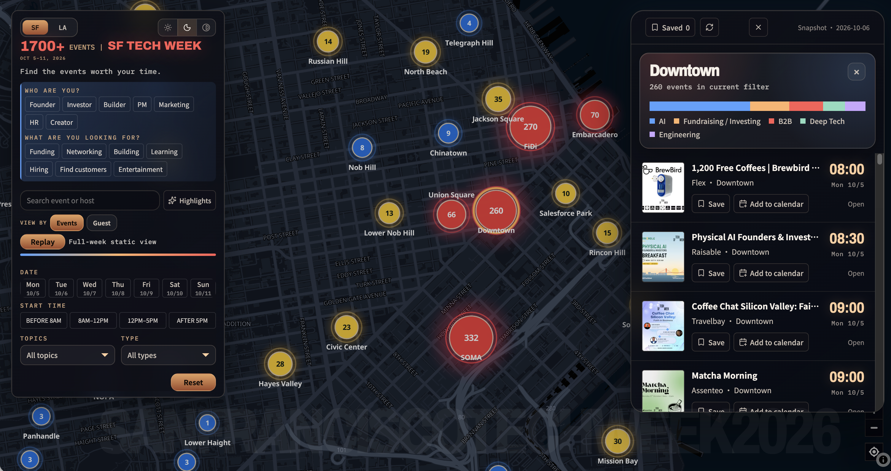
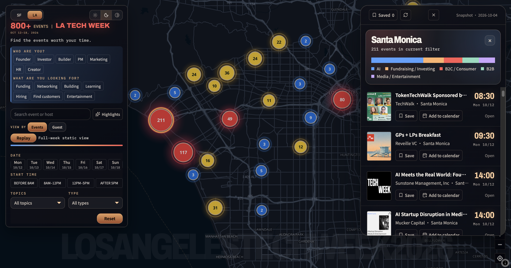

# SF + LA Tech Week 2026 Event Map

[Open the interactive map](https://unsalty-labs.github.io/tech-week-site/)

## About

A neighborhood-first map for exploring San Francisco and Los Angeles Tech Week 2026. It brings the official event calendars together with search, audience and intent filters, curated highlights, and public guest-count signals.

Explore SF events for October 5–11 and LA events for October 12–18. Find relevant events, see where activity is concentrated, and build a personal shortlist without creating an account.




## Features

- **Two cities:** switch between SF and LA, each with its own dates, neighborhoods and event data.
- **Interactive map:** explore neighborhood bubbles by event density or available public guest signals; select a neighborhood to browse its activities.
- **Search and filters:** search event names or hosts and filter by date, start time, topic, type, audience and intent.
- **Highlights:** discover curated activities, with category colors and clickable category filters.
- **Saved events:** save and remove events in your browser, then browse your shortlist.
- **Calendar export:** download an event as an `.ics` calendar file using Pacific time.
- **Timeline replay:** watch the week unfold, including filtered selections. Desktop supports an intro replay; mobile replay starts manually.
- **Dedicated mobile layout:** full-height map, compact search, bottom navigation, a filter drawer, and an expandable activity sheet.
- **Published-data updates:** check for newer website data manually or every five minutes, with a refresh prompt when an update is available.


## Tech Stack

React + Vite for the frontend, MapLibre GL JS with OpenFreeMap for maps, Lucide for icons, and a separate Node.js MCP service. The published GitHub Pages site is static; visitors do not need Node.js.

## Run Locally

Use Node.js 22.12+ or 24 and npm. From the repository root:

```bash
cd web
npm ci
npm run dev
```

Open [http://127.0.0.1:8765/](http://127.0.0.1:8765/). The basemap and web fonts require internet access. Narrow the browser window to preview the mobile layout; on a phone, use the published website link.

### Production Preview

From `web`:

```bash
npm run build
npm run preview -- --port 8766
```

Open [http://127.0.0.1:8766/](http://127.0.0.1:8766/). This serves the generated frontend, not the MCP endpoint. Source HTML must run through Vite rather than being opened directly.

## Tests

With the development server running, run these in another terminal inside `web`:

```bash
npm test
npm run test:ui
npm run test:mobile
```

`npm test` includes a comparison against local master JSON files under `data/00-ready-to-use-data`, which are not committed. Without those files, run the standalone unit tests with `node --test test-event-actions.mjs mcp/test-service.mjs`.

Browser tests use installed Google Chrome on macOS. For Safari-engine coverage:

```bash
npx playwright install webkit
TEST_BROWSER=webkit npm run test:mobile
```
